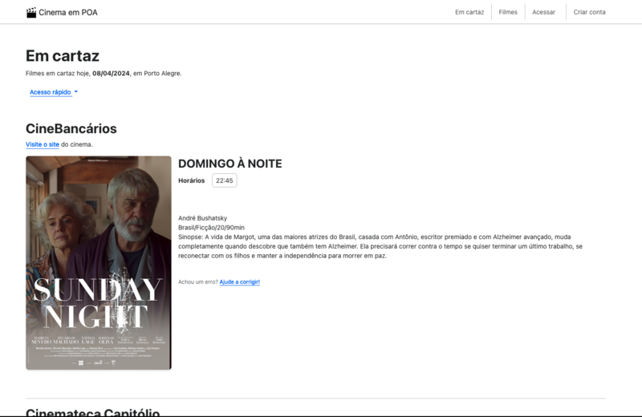

# CINEMA EM POA

CINEMA EM POA é um portal agregador de filmes das casas de cinema de Porto Alegre.

Ele consegue o conteúdo realizando _web scrapping_ em quatro diferentes sites:

- [CineBancários](http://cinebancarios.blogspot.com/?view=classic)
- [Cinemateca Paulo Amorim](https://www.cinematecapauloamorim.com.br)
- [Cinemateca Capitólio](http://www.capitolio.org.br)
- [Sala Redenção](https://www.ufrgs.br/difusaocultural/salaredencao/)

O projeto tem código aberto e aceita contribuições.

## Desenvolvimento

O projeto é composto de dois módulos: `scrapers/`, que contém a lógica para coleção de dados e `flask_backend/`, onde fica o código do portal.

O projeto foi desenvolvido em Python 3.10 e funciona com qualquer versão superior.

A instalação recomendada é usando um [ambiente virtual (venv)](https://docs.python.org/3/library/venv.html).

    python3 -m venv .venv
    source .venv/bin/activate
    pip3 install -r requirements.txt

O banco de dados utilizado é o [sqlite3](https://www.sqlite.org/).

É utilizado o pre-commit para formatar o código, para iniciar ele rode:

    pre-commit install

### Rodando o projeto

Para rodar o portal, você vai precisar de três comando (todos rodados a partir da raíz do projeto):

    flask --app flask_backend init-db # inicializa as tabelas no banco de dados
    flask --app flask_backend seed-db # optional: popula o banco com dados iniciais
    flask --app flask_backend run --debug # inicia o projeto em modo desenvolvimento

O projeto vai rodar em <http://localhost:5000>.

Se você rodou o comando para popular o banco de dados, vai ter um usuário admin criado com login: cinemaempoa e senha: 123123.

Você pode fazer login via <http://localhost:5000/auth/login>.

### Utilizando os scrappers

Os scrappers podem ser disparados através da interface web na URL <http://127.0.0.1:5000/screening/import>, clicando no botão "Fazer Scrapping". Neste caso, será feita a raspagem de todas as quatro salas de cinema cadastradas.

Alternativamente, os scrappers também podem ser rodados via linha de comandos, com o script

    ./cinemaempoa.py -h

    usage: cinemaempoa [-h] [-b] [--deploy] [--date DATE] [-r ROOMS [ROOMS ...] | -j JSON]

    Grab the schedule for Porto Alegre's finest features

    options:
    -h, --help            show this help message and exit
    -b, --build           Builds scrapped json as an html file
    --deploy              Saves generated html at docs/index.html - saves the old index file in YYYY-MM-DD.html format
    --date DATE           Runs the scrapper as if the current date is the given YYYY-MM-DD value
    -r ROOMS [ROOMS ...], --rooms ROOMS [ROOMS ...]
                            Filter specific rooms. Available: capitolio, sala-redencao, cinebancarios, paulo-amorim
    -j JSON, --json JSON  JSON filepath to build index.html from

Para disparar os scrappers e conseguir os filmes em cartaz em formato json (que pode ser importado no portal), rode o comando com a flag `r`, listando as salas de cinema desejadas, e direcione a saída para um arquivo.

    ./cinemaempoa.py -r capitolio sala-redencao cinebancarios paulo-amorim > import.json

Você pode inspecionar o arquivo `import.json` resultante para entender melhor a estrutura de saída dos scrappers.

### Importando dados no portal

Após logar, vá para a página <http://localhost:5000/screening/import>.

Lá, selecione o arquivo gerado na etapa anterior e clique em **Enviar**.

As sessões importadas vão estar disponíveis na home.

## Contribuições

Veja nossos [issues](https://github.com/guites/cinemaempoa/issues) pra entender o que está sendo feito no projeto.

Implementações mais simples estão marcadas com [good first issue](https://github.com/guites/cinemaempoa/issues?q=is%3Aopen+is%3Aissue+label%3A%22good+first+issue%22).
