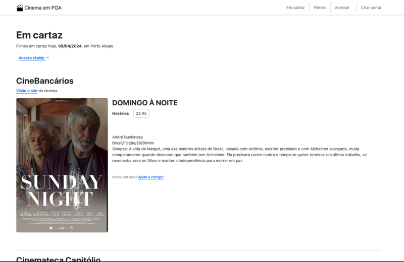

# CINEMA EM POA

CINEMA EM POA é um portal agregador de filmes das casas de cinema de Porto Alegre.

Está rodando em <https://cinemaempoa.com.br>.



O conteúdo é agregado realizando _web scrapping_ em quatro diferentes sites:

- [CineBancários](http://cinebancarios.blogspot.com/?view=classic)
- [Cinemateca Paulo Amorim](https://www.cinematecapauloamorim.com.br)
- [Cinemateca Capitólio](http://www.capitolio.org.br)
- [Sala Redenção](https://www.ufrgs.br/difusaocultural/salaredencao/)

O projeto encoraja contribuições (veja [Contribuições](#contribuicoes)).

## Arquitetura

O projeto é composto de dois aplicativos independentes:

- **`web/`** — O portal Flask que serve o site. Roda na VPS como um container Docker. Expõe uma API HTTP autenticada (`POST /api/import`, `PATCH /api/screenings/{id}/poster`) para receber dados do runner.
- **`runner/`** — Pacote Python autônomo que contém os scrapers e a lógica de busca de posters. Roda nos GitHub Actions e envia os dados para o portal via HTTP. Não possui dependência do Flask ou SQLAlchemy.
- **`shared/`** — Módulo compartilhado com os dataclasses (`ScrappedResult`, `ScrappedCinema`, `ScrappedFeature`) que definem o contrato JSON entre runner e portal.

Os workflows do GitHub Actions (`run-spiders.yml`, `import-cinebancarios.yml`, `fetch-posters.yml`) instalam o runner localmente e chamam a API do portal — sem SSH para a VPS.

## Desenvolvimento

O projeto é composto de dois módulos: `runner/`, que contém a lógica para coleção de dados e `web/`, onde fica o código do portal.

Este projeto requer Python 3.10.x ou 3.11.x. Versões superiores não são suportadas no momento. Recomendamos utilizar a série 3.10 (por exemplo, 3.10.19).

O banco de dados utilizado é o [sqlite3](https://www.sqlite.org/).

### Instalando o projeto localmente

A instalação recomendada é usando um [ambiente virtual (venv)](https://docs.python.org/3/library/venv.html).

    python3 -m venv .venv
    source .venv/bin/activate
    pip3 install -r requirements.txt

### Instalando o projeto usando Docker

Você pode usar o arquivo `docker-compose.dev.yml` para iniciar um container com todas as dependências necessárias.

    docker compose -f docker-compose.dev.yml up -d

Ao utilizar o docker, os comandos mencionados na seção seguinte devem ser rodados de dentro do container.

    # utilize o `docker exec` para abrir um terminal dentro do container
    docker exec -it cinemaempoa_flask_dev bash

Antes de abrir um Pull Request, rode os comandos abaixo no seu terminal para validar e formatar o código:

```bash
ruff check --fix # roda o linter para código python
ruff format # roda o formatter para código python
djlint web/templates --lint --profile=jinja # roda o linter para os arquivos .html
djlint --reformat web/templates --format-css --format-js # roda o formatter para os arquivos .html
```

Opcionalmente, o [pre-commit](https://pre-commit.com/) pode automatizar a formatação do código quando você rodar um `git commit`.

Para utilizá-lo, instale com:

    pre-commit install

### Rodando o projeto

Para rodar o portal, você vai precisar de três comandos (todos rodados a partir da raíz do projeto):

    flask --app web init-db # inicializa as tabelas no banco de dados
    flask --app web seed-db # optional: popula o banco com dados iniciais
    flask --app web run --debug # inicia o projeto em modo desenvolvimento

Lembre-se de utilizar a flag `--host=0.0.0.0` caso esteja rodando o projeto através do docker de desenvolvimento (docker-compose.dev.yml).

O projeto vai rodar em <http://localhost:5000>.

**Nota para usuários macOS:** Se você estiver usando macOS e encontrar um erro 403 ao reiniciar a aplicação, a porta 5000 pode estar sendo usada pelo AirPlay Receiver. Nesse caso, use uma porta alternativa:

    flask --app web run --debug --port=5001

Se você rodou o comando para popular o banco de dados, vai ter um usuário admin criado com login: cinemaempoa e senha: 123123.

Você pode fazer login via <http://localhost:5000/auth/login>.

### Migrações do Banco de Dados

O projeto utiliza [Alembic](https://alembic.sqlalchemy.org/) para gerenciar migrações do banco de dados. Isso permite que alterações no schema sejam versionadas e aplicadas de forma controlada.

#### Comandos disponíveis:

- `flask --app web init-db` - Aplica todas as migrações pendentes (inicializa ou atualiza o banco)
- `flask --app web db-upgrade [revision]` - Aplica migrações até uma revisão específica (padrão: head)
- `flask --app web db-downgrade [revision]` - Reverte migrações até uma revisão específica
- `flask --app web db-revision --autogenerate -m "mensagem"` - Cria uma nova migração automaticamente baseada nas mudanças nos modelos
- `flask --app web db-current` - Mostra a revisão atual do banco de dados
- `flask --app web db-history` - Mostra o histórico de migrações

#### Criando uma nova migração:

Quando você modificar os modelos em `web/models.py`, crie uma nova migração:

    flask --app web db-revision --autogenerate -m "Descrição da mudança"

### Utilizando os scrappers (runner)

Os scrapers ficam em `runner/` e são executados via linha de comando. Instale as dependências do runner:

    pip install -r requirements.runner.txt

Para scraping e importação completa (scrape + envio ao portal + busca de posters):

    python runner/main.py \
        --rooms capitolio sala-redencao paulo-amorim \
        --api-url http://localhost:5000 \
        --api-token <IMPORT_API_TOKEN>

Para apenas atualizar posters de sessões existentes:

    python runner/main.py \
        --poster-only \
        --api-url http://localhost:5000 \
        --api-token <IMPORT_API_TOKEN>

Veja `python runner/main.py --help` para todas as opções. Veja também o [README do runner](./runner/README.md).

**Secrets necessários no GitHub Actions:** `APP_URL`, `IMPORT_API_TOKEN`.

### Testes automatizados

O projeto possui alguns (poucos) testes automatizados. Certifique-se de que eles estão atualizados e passando sempre que você fizer alguma modificação no código.

#### Testes do portal

Veja o [README dos testes](./web/tests/README.md) do portal.

#### Testes dos scrappers

Veja os testes em [./tests](./tests/).

<h2 id="contribuicoes">Contribuições</h2>

Veja nossos [issues](https://github.com/guites/cinemaempoa/issues) pra entender o que está sendo feito no projeto.

Implementações mais simples estão marcadas com [good first issue](https://github.com/guites/cinemaempoa/issues?q=is%3Aopen+is%3Aissue+label%3A%22good+first+issue%22).

## Deploy (produção)

Atualmente o projeto (em <https://cinemaempoa.com.br>) está hospedado em uma máquina virtual.

Os arquivos usados para o deployment são:

- .env (deve ser criado a partir do example.env).
- docker-compose.production.yml
- Dockerfile.prod

A cada novo merge no branch principal, o workflow em `.github/workflows/deploy-server.yml` faz o processo de atualização do servidor.

## Backups do banco de dados

Diariamente uma cópia do banco de dados é enviada para o google drive em <https://drive.google.com/drive/u/0/folders/1f9qFHb2Fxdg_EGg3Vq4W-leDaGed9kXk>.

O processo é automatizado pelo script `backup-db.sh` em um _cronjob_ na máquina virtual.

```
$ crontab -l
55 23 * * * cd /home/ubuntu/cinemaempoa && ./backup-db.sh
```
