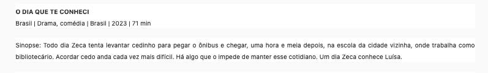
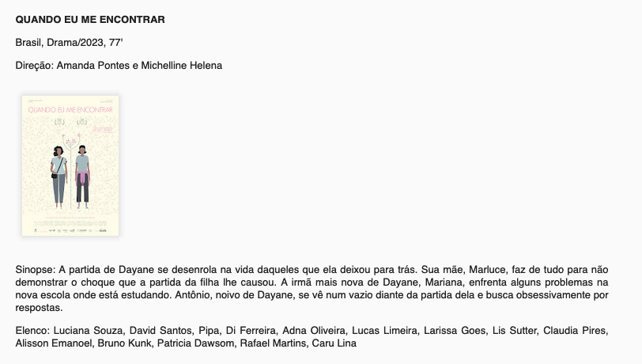

# scrapers

Este diretório possui a implementação para raspagem
de dados nos sites do cinema.

Cada site possui seu próprio scraper devido às particularidades da estrutura
dos sites.

## Cache

Todos os scrapers seguem a mesma política de cache, implementada nos módulos
compartilhados [./http_cache.py](./http_cache.py) e [./llm_cache.py](./llm_cache.py):

- **Requisições HTTP**: sem cache em produção — cada execução busca a página
  novamente. Fora de produção (`APP_ENVIRONMENT != "production"`), a resposta é
  salva em disco e reaproveitada em execuções seguintes, principalmente pra
  facilitar iteração local sem martelar os sites de origem. Ver `fetch_page` em
  [./http_cache.py](./http_cache.py).
- **Parsing determinístico**: nunca é cacheado — cada execução reprocessa o HTML
  já obtido.
- **Chamadas de LLM**: sempre cacheadas, em qualquer ambiente, com base em um hash
  SHA-256 do texto extraído da página (ver `get_features_with_cache` em
  [./llm_cache.py](./llm_cache.py)). Isso existe pra controlar o custo/limite de
  taxa das chamadas de LLM, já que rodar o scraper com frequência não significa
  que o conteúdo da página realmente mudou.

## CineBancários

O site do projeto é <https://cinebancarios.blogspot.com/>. Se você acessá-lo
com o javascript do navegador desabilitado, vai notar que o site fica uma
página em branco.

Isso é porque o blogspot é renderizado no lado do cliente. Isso dificulta o
webscrapping pois precisariamos de uma ferramenta capaz de rodar javascript.

Pra burlar esse problema, nós acessamos o [feed RSS](https://pt.wikipedia.org/wiki/RSS)
do site (disponível em <http://cinebancarios.blogspot.com/feeds/posts/default?alt=rss>).

O feed é em formato XML, mas, aninhado dentro do XML, existe o conteúdo HTML
das postagens.

O blogspot gera o HTML da página de forma bem desestruturada e caótica. Ao invés
dos campos serem bem definidos, o HTML das postagens costuma mudar, mesmo quando
a estrutura do conteúdo é a mesma.



O bloco de texto acima (disponível em <https://cinebancarios.blogspot.com/2024/09/premiado-o-dia-que-te-conheci-estreia.html>)
tem a seguinte estrutura HTML:

```html
<p>
    <span>
        <strong>
            O DIA QUE TE CONHECI<br>
        </strong>
        Brasil | Drama, comédia | Brasil | 2023 | 71 min
    </span>
</p>
<p>
    <span>
        Sinopse: Todo dia Zeca tenta levantar cedinho para pegar o ônibus e chegar, uma hora e meia depois, na escola da cidade vizinha, onde trabalha como bibliotecário. Acordar cedo anda cada vez mais difícil. Há algo que o impede de manter esse cotidiano. Um dia Zeca conhece Luísa.
    </span>
</p>
```

Repare que não tem nada indicando onde está o título do filme, onde está o
país, gênero, ano, etc.

Por causa disso, é preciso se basear no conteúdo da página: notamos que o
padrão utilizado é sempre colocar **Sinopse:** para descrever o assunto do filme.

Acima da sinopse, fica uma linha com o país de origem, o gênero, ano e duração do filme.

Acima disso, o título.

Outras postagens, porém, seguem outro padrão:



Na imagem acima (disponível em <https://cinebancarios.blogspot.com/2024/09/assexybilidade-de-daniel-goncalves.html>),
o HTML do bloco é diferente do anterior:

```html
<p>
    <b>
        <span>
            QUANDO EU ME ENCONTRAR
        </span>
    </b>
</p>
<p>
    <span>
        Brasil, Drama/2023, 77'
    </span>
</p>
<p>
    <span>
        <span>
            Direção: Amanda Pontes e&nbsp;
        </span>
        <span>
            Michelline Helena
        </span>
    </span>
</p>
<p>
    <a>
        <span>
            
        </span>
    </a>
</p>
<p>
    <span>
        <span>
            Sinopse:&nbsp;
        </span>
        <span>
            A partida de Dayane se desenrola na vida daqueles que ela deixou para trás. Sua mãe, Marluce, faz de tudo para não demonstrar o choque que a partida da filha lhe causou. A irmã mais nova de Dayane, Mariana, enfrenta alguns problemas na nova escola onde está estudando. Antônio, noivo de Dayane, se vê num vazio diante da partida dela e busca obsessivamente por respostas.
        </span>
    </span>
</p>
<p>
    <span>
        <span>
            Elenco:&nbsp;
        </span>
        <span>
            Luciana Souza, David Santos, Pipa, Di Ferreira, Adna Oliveira, Lucas Limeira, Larissa Goes, Lis Sutter, Claudia Pires, Alisson Emanoel, Bruno Kunk, Patricia Dawsom, Rafael Martins, Caru Lina
        </span>
    </span>
</p>
```

Repare que o título do filme não está mais dentro de um `<strong>`, o gênero
e país, que antes estavam soltos, agora estão dentro do seu próprio `<span>`, etc.

Por causa disso, optamos pelo uso de LLMs que consomem o conteúdo da postagem
(apenas o texto, sem as tags HTML) e (tentam) retornar um JSON válido que pode
ser importado pra dentro da plataforma.

Você pode ver a implementação (prompts e regras de negócio) no arquivo [./llms.py](./llms.py).

## Paulo Amorim (newsletter por e-mail)

Além do scraper de HTML (`scrapers/paulo_amorim.py`), existe uma segunda fonte de dados
para a Cinemateca Paulo Amorim: `scrapers/paulo_amorim_email.py`, que lê a newsletter
semanal enviada por e-mail e usa uma LLM pra extração das sessões (mesma estratégia do
CineBancários, ver acima). Essa segunda fonte existe porque a newsletter costuma chegar
com alguns dias de antecedência em relação à atualização do site, e o site às vezes atrasa
alguns dias no início de cada semana (ver issue #251).

As duas fontes rodam de forma independente e escrevem sessões pra mesma sala
(`paulo-amorim`) no banco. Eventuais duplicatas entre elas são resolvidas pelo
`flask --app flask_backend run-dedupper`, que já existe pra esse propósito.

### Recebendo os e-mails

Uma conta de e-mail dedicada (Gmail, com senha de app) é cadastrada na newsletter e
consultada via IMAP (biblioteca `imap-tools`) uma vez por dia. Só mensagens não lidas do
remetente da newsletter são processadas; cada mensagem só é marcada como lida depois que
a extração via LLM funciona - se a extração falhar, a mensagem continua não lida e é
reprocessada no próximo dia.

Variáveis de ambiente necessárias (ver `example.env`):

- `PAULO_AMORIM_EMAIL_ADDRESS` / `PAULO_AMORIM_EMAIL_APP_PASSWORD`: credenciais IMAP da
  conta dedicada.
- `PAULO_AMORIM_NEWSLETTER_SENDER_EMAIL`: endereço de origem da newsletter, usado pra
  filtrar quais e-mails da caixa de entrada são processados.

### Formato da newsletter

Ao contrário da página `grade-semanal` do site (organizada por dia, com uma linha por
sessão), o e-mail é organizado por sala (Sala Paulo Amorim, Sala Eduardo Hirtz, Sala
Norberto Lubisco), com um bloco de texto por filme contendo um único horário e exceções
descritas em linguagem natural, por exemplo:

```
FRANZ (...). Direção de Agnieszka Holland...
Sinopse: ...
Sessões: 19h15min (exibições nos dias 25, 26, 28 e 29 – de sábado a quarta-feira)
```

O prompt em `PauloAmorimEmailExtractorLLM` (`scrapers/llms.py`) é responsável por expandir
essas exceções (e a exceção global do tipo "SEGUNDA-FEIRA NÃO HÁ SESSÕES") em datas
concretas.

## Cine Cinco

O site do projeto é <https://www.pucrs.br/cultura/projetos/cine-cinco/>. Diferente
do CineBancários, essa página é renderizada no servidor (não precisa de
javascript pra carregar o conteúdo), então o HTML pode ser obtido com uma
requisição HTTP comum.

A programação inteira fica dentro de uma única `div.content`. Cada filme é
um bloco de texto (título, pôster, direção, informações gerais, sinopse e
sessão) separado dos outros por uma tag `<hr>`, mas assim como no CineBancários,
a estrutura interna de cada bloco muda de postagem pra postagem (às vezes tem
direção, às vezes não; às vezes tem `<a>` em volta do pôster, às vezes não). Por
isso, também optamos por usar um LLM que consome o texto (sem tags HTML) do
bloco `div.content` e retorna um JSON estruturado — implementação em [./llms.py](./llms.py),
classe `CineCincoExtractorLLM`.

Particularidade desse site, comparado ao CineBancários:

- As datas de sessão (`Sessão: 1/7 • quarta — 17h`) não têm ano. Como a
página não tem um RSS feed com data de publicação, assumimos que o ano da
sessão é sempre o ano atual no momento da raspagem — uma limitação conhecida
da v0 perto da virada do ano.
