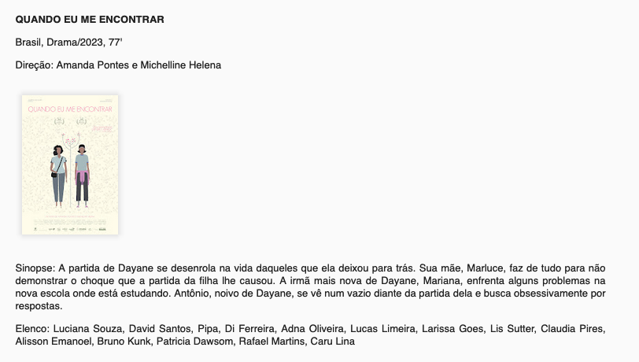

# scrapers

Este diretório possui a implementação para raspagem
de dados nos sites do cinema.

Cada site possui seu próprio scraper devido às particularidades da estrutura dos sites.

## CineBancários

O site do projeto é <https://cinebancarios.blogspot.com/>. Se você acessá-lo com o javascript do navegador desabilitado, vai
notar que o site fica uma página em branco.

Isso é porque o blogspot é renderizado no lado do cliente. Isso dificulta o webscrapping pois precisariamos de uma
ferramenta capaz de rodar javascript.

Pra burlar esse problema, nós acessamos o [feed RSS](https://pt.wikipedia.org/wiki/RSS) do site (disponível em <http://cinebancarios.blogspot.com/feeds/posts/default?alt=rss>).

O feed é em formato XML, mas, aninhado dentro do XML, existe o conteúdo HTML das postagens.

O blogspot gera o HTML da página de forma bem desestruturada e caótica. Ao invés dos campos serem bem definidos, o HTML das postagens costuma mudar, mesmo quando a
estrutura do conteúdo é a mesma.


O bloco de texto acima (disponível em <https://cinebancarios.blogspot.com/2024/09/premiado-o-dia-que-te-conheci-estreia.html>) tem a seguinte estrutura HTML:

```
<p>
    <span>
        <strong>
            O DIA QUE TE CONHECI<br>
        </strong>
        Brasil | Drama, comédia | Brasil | 2023 | 71 min
    </span>
</p>
<p>
    <span>
        Sinopse: Todo dia Zeca tenta levantar cedinho para pegar o ônibus e chegar, uma hora e meia depois, na escola da cidade vizinha, onde trabalha como bibliotecário. Acordar cedo anda cada vez mais difícil. Há algo que o impede de manter esse cotidiano. Um dia Zeca conhece Luísa.
    </span>
</p>
```

Repare que não tem nada indicando onde está o título do filme, onde está o país, gênero, ano, etc.

Por causa disso, é preciso se basear no conteúdo da página: notamos que o padrão utilizado é sempre colocar **Sinopse:** para descrever o assunto do filme.

Acima da sinopse, fica uma linha com o país de origem, o gênero, ano e duração do filme.

Acima disso, o título.

Outras postagens, porém, seguem outro padrão:



Na imagem acima (disponível em <https://cinebancarios.blogspot.com/2024/09/assexybilidade-de-daniel-goncalves.html>), o HTML do bloco é diferente do anterior:

```
<p>
    <b>
        <span>
            QUANDO EU ME ENCONTRAR
        </span>
    </b>
</p>
<p>
    <span>
        Brasil, Drama/2023, 77'
    </span>
</p>
<p>
    <span>
        <span>
            Direção: Amanda Pontes e&nbsp;
        </span>
        <span>
            Michelline Helena
        </span>
    </span>
</p>
<p>
    <a>
        <span>
            
        </span>
    </a>
</p>
<p>
    <span>
        <span>
            Sinopse:&nbsp;
        </span>
        <span>
            A partida de Dayane se desenrola na vida daqueles que ela deixou para trás. Sua mãe, Marluce, faz de tudo para não demonstrar o choque que a partida da filha lhe causou. A irmã mais nova de Dayane, Mariana, enfrenta alguns problemas na nova escola onde está estudando. Antônio, noivo de Dayane, se vê num vazio diante da partida dela e busca obsessivamente por respostas.
        </span>
    </span>
</p>
<p>
    <span>
        <span>
            Elenco:&nbsp;
        </span>
        <span>
            Luciana Souza, David Santos, Pipa, Di Ferreira, Adna Oliveira, Lucas Limeira, Larissa Goes, Lis Sutter, Claudia Pires, Alisson Emanoel, Bruno Kunk, Patricia Dawsom, Rafael Martins, Caru Lina
        </span>
    </span>
</p>
```

Repare que o título do filme não está mais dentro de um `<strong>`, o gênero e país, que antes estavam soltos, agora estão dentro do seu próprio `<span>`, etc.

Por causa disso, acabamos criando diversas funções, onde uma lida com cada formato de postagem, e vamos testando-as uma por uma, na tentativa de extrair a listagem de filmes e seus horários.

O diagrama abaixo mostra o fluxo lógico do algoritmo de scrapping específico do cinebancários.


